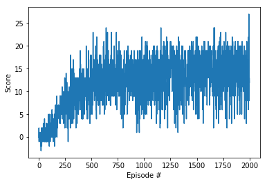

# A Deep Q-Network (DQN) approach to solve the Banana environment

### Algorithm and architecture
In order to solve the Banana environment, an implementation of the DQN learning algorithm is used.    

In essence, the DQN approach consists of the following tasks:
1) Collect and store in a dedicated buffer the samples ("experiences") in the form of the tuple `(S,A,R,S')`, 
   where `S` is the current state, `A` is the action taken following the policy, `R` is the reward obtain 
   and `S'` is the new state.  
2) Periodically (randomly) sample from the buffer a set of experiences and use them to update the 
   target network (_Experience Replay_) using gradient descent. 
   
The DQN algorithm allows to break the correlation between consecutive experiences and largely reduces
the correlation with the target by updating only periodically.
These two factors combined largely improves the stability of the function approximation step of the 
Q-learning paradigm. 

In DQN the action-value function `Q(s,a)` is approximated with a Deep Neural Network (NN) `Q(s,a; w_i)`, 
where `w_i` are the weights of the NN.   
In our implementation a simple 3-layer multi-layer perceptron (MLP) is used, with 256 neurons in each layer. 
The output dimension reflects the number of discrete actions in the environment (4).

The (hyper-)parameters used are the followings:
- `BATCH_SIZE=64`: size of the set of experiences used for replay
- `LR=5e-4`: learning rate used for the gradient descent step
- `UPDATE_EVERY=4`: how often the target network is updated
- `GAMMA=0.99`: discount factor

### Results
Our implementation solves the Banana environment (i.e. average reward (over 100 episodes) >= +13) in 570 episodes. 
The best average score achieved is +15, reached after ~1900 episodes.

### Ideas for improvements